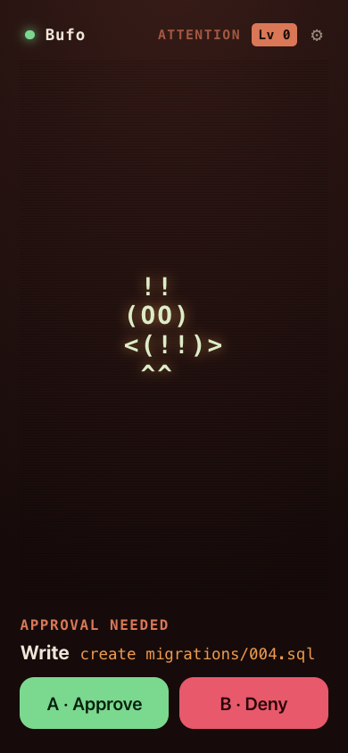

# Claude Buddy (unofficial)

A friendly desk-pet that mirrors Claude over Bluetooth and lets you **approve or deny
Claude Code permission prompts with a tap**. It's an unofficial reimplementation of
Anthropic's [`claude-desktop-buddy`](https://github.com/anthropics/claude-desktop-buddy)
reference — instead of an ESP32, it runs as a **web app** and as an **Android app**
(via Capacitor) that turns your phone into the BLE buddy device.

> Unofficial and not affiliated with Anthropic. It implements the public Hardware Buddy
> BLE wire protocol — see the upstream
> [`REFERENCE.md`](https://github.com/anthropics/claude-desktop-buddy/blob/main/REFERENCE.md)
> (a quick pointer + the NUS UUIDs are in [`docs/REFERENCE.md`](docs/REFERENCE.md)).

<p align="center">
  
</p>

## What it does

- A pixel-LCD pet with the seven canonical states (`sleep · idle · busy · attention ·
  celebrate · dizzy · heart`) and four ASCII species, plus gamified gauges (mood / fed /
  energy / level) and counters (approved / denied / napped / tokens).
- **Approve / Deny** Claude Code permission prompts from the device; the decision is sent
  straight back over the wire.
- Responsive single-screen UI (portrait stacks; landscape puts the pet left, info right).
- On the phone: shake → dizzy, face-down → nap, and a buzz when a prompt arrives.

## Two forms, one shared `web/`

1. **Browser** — vanilla JS, no build step. Acts as a BLE *central* and uses a built-in
   simulator as a stand-in Claude feed (a web page can't be a BLE peripheral).
2. **Android** — the same `web/` wrapped with [Capacitor](https://capacitorjs.com),
   acting as a BLE *peripheral* so Claude Desktop can connect **to the phone**.

### Run the browser version

Web Bluetooth needs a secure context (Chrome/Edge over `localhost` or `https`):

```bash
cd web && python3 -m http.server 8000   # open http://localhost:8000
```

Use **Start Claude feed** to drive the simulated session and **Force prompt** to raise an
approval.

### Build the Android app

See [`BUILDING-ANDROID.md`](BUILDING-ANDROID.md) for the full walkthrough.

```bash
npm install
npx cap sync android
npx cap open android   # then Run ▶ in Android Studio
```

Re-run `npx cap copy android` after any change under `web/` (the native app serves a copy).

## Architecture

Plain `<script>` tags load five files (`web/index.html`), each attaching one global:
`Protocol` (wire format + line parser), `Buddy` (species + animator), `BleLink` (Web
Bluetooth central), `ClaudeSimulator` (demo feed), `BlePeripheral` (native peripheral
bridge), plus the `app.js` wiring IIFE. Everything downstream of `Protocol.LineParser` is
source-agnostic — the simulator and a real BLE device produce the same parsed objects.

The Android peripheral is a small custom Capacitor plugin in
`android/app/src/main/java/se/swimbird/claudebuddy/` (`BlePeripheralPlugin.java`) that runs
a `BluetoothGattServer` advertising the Nordic UART Service.

## Connecting to Claude Desktop

Claude Desktop exposes this BLE bridge only in **developer mode** (Help → Troubleshooting →
Enable Developer Mode → Developer → Open Hardware Buddy). Scan and connect to the advertised
**"Claude …"** device.

### Notes & known limitations (learned the hard way)

- **Unencrypted / no bonding by design.** Bonding makes macOS cache the GATT and skip
  re-subscribing after the phone app restarts (a fresh GATT server), which Android can't fix
  with a Service-Changed indication. Unbonded means every connect is a clean
  discovery+subscribe, so restarting the app works — you just click **Connect** on the desktop
  again (no silent auto-reconnect). The desktop will note "Connection is unencrypted."
- **Clear stale macOS bonds via System Settings → Bluetooth**, not just Claude Desktop's
  "Forget" — a half-bond throws `Code=14 "Peer removed pairing information"`.
- The status ack includes `bat` and `sys` because the desktop panel shows "No response"
  without them (despite the spec calling them optional).
- **Live session/permission data depends entirely on what Claude Desktop sends.** In some
  setups the desktop streams only a static idle heartbeat, so the buddy stays idle and never
  shows a prompt even though the device, connection, and approve/deny path all work. This is
  on the Claude Desktop side, not the device — the Hardware Buddy bridge is an experimental
  maker feature.

## Credits

Protocol and concept from Anthropic's [`claude-desktop-buddy`](https://github.com/anthropics/claude-desktop-buddy).
This project is an independent, unofficial implementation.

## License

[MIT](LICENSE) © 2026 Anders Bea
