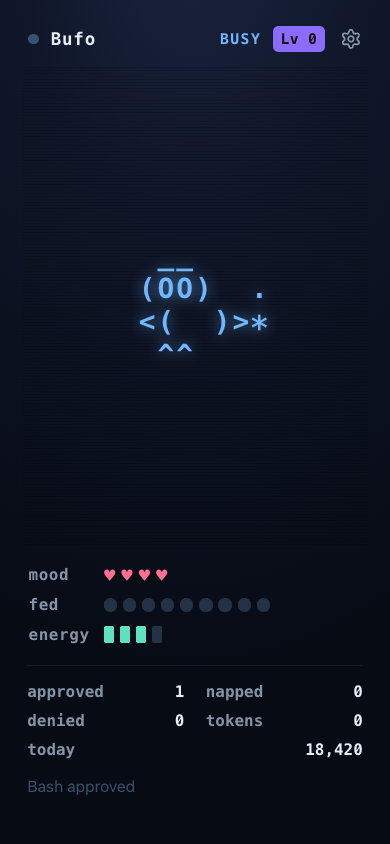

# Claude Buddy (unofficial)

A friendly desk-pet that mirrors Claude over Bluetooth and lets you **approve or deny
Claude Code permission prompts with a tap**. It's an unofficial reimplementation of
Anthropic's [`claude-desktop-buddy`](https://github.com/anthropics/claude-desktop-buddy)
reference — instead of an ESP32, it runs as a **web app** and as an **Android app**
(via Capacitor) that turns your phone into the BLE buddy device.

> Unofficial and not affiliated with Anthropic. It implements the public Hardware Buddy
> BLE wire protocol — see the upstream
> [`REFERENCE.md`](https://github.com/anthropics/claude-desktop-buddy/blob/main/REFERENCE.md)
> (a quick pointer + the NUS UUIDs are in [`docs/REFERENCE.md`](docs/REFERENCE.md)).

<p align="center">
  
  &nbsp;&nbsp;
  
</p>
<p align="center"><em>Default warm theme, and the built-in midnight theme (themes are runtime-toggleable).</em></p>

## What it does

- A pixel-LCD pet with the seven canonical states (`sleep · idle · busy · attention ·
  celebrate · dizzy · heart`) and four ASCII species, plus gamified gauges (mood / fed /
  energy / level) and counters (approved / denied / napped / tokens).
- **Approve / Deny** Claude Code permission prompts from the device; the decision is sent
  straight back over the wire.
- Responsive single-screen UI (portrait stacks; landscape puts the pet left, info right).
- On the phone: shake → dizzy, face-down → nap, and a buzz when a prompt arrives.

## Tech

**React + TypeScript + Vite**, styled with **Tailwind v4** (theming via CSS variables) and
**Lucide** icons. Tests run on **Vitest** + Testing Library. It ships in two forms from the
same `src/`:

1. **Browser** — runs a built-in simulator as a stand-in Claude feed (a web page can't be a
   BLE peripheral, so this is the demo/design surface).
2. **Android** — wrapped with [Capacitor](https://capacitorjs.com), acting as a BLE
   *peripheral* so Claude Desktop can connect **to the phone**.

### Develop / test

```bash
npm install
npm run dev        # Vite dev server (Web Bluetooth needs localhost/https)
npm test           # Vitest — protocol, stats, and component tests
npm run typecheck  # tsc --noEmit
npm run build      # type-check + production build to dist/
```

In the browser, open ⚙ Settings → **Start Claude feed** to drive the simulated session and
**Force prompt** to raise an approval. The ⚙ sheet also has a **theme** toggle.

### Build the Android app

See [`BUILDING-ANDROID.md`](BUILDING-ANDROID.md) for the full walkthrough.

```bash
npm run build              # build the web app into dist/ (Capacitor's webDir)
npx cap sync android
npx cap open android       # then Run ▶ in Android Studio
```

Re-run `npm run build && npx cap copy android` after web changes (the native app serves a copy of `dist/`).

## Architecture

- `src/lib/` — framework-free, unit-tested core: `protocol.ts` (wire format, `LineParser`,
  builders — the single source of truth for the NUS UUIDs), `buddy.ts` (species + frames),
  `stats.ts` (pure gamified-stat math), `simulator.ts` (demo feed), `ble/peripheral.ts`
  (native plugin bridge). Everything downstream of `LineParser` is source-agnostic.
- `src/hooks/` — `useBuddy` (orchestrates the message source, connection state, sleep
  semantics, approvals, and stats), `useBuddyAnimation`, `useTheme`.
- `src/components/` — small reusable components (`Pips`, `Gauge`, `BuddyScreen`,
  `ApprovalPrompt`, `SettingsSheet`, `Device`, …); icons come from one place (`src/lib/icons.ts`).

The Android peripheral is a small custom Capacitor plugin in
`android/app/src/main/java/se/swimbird/claudebuddy/` (`BlePeripheralPlugin.java`) that runs
a `BluetoothGattServer` advertising the Nordic UART Service.

## Connecting to Claude Desktop

Claude Desktop exposes this BLE bridge only in **developer mode** (Help → Troubleshooting →
Enable Developer Mode → Developer → Open Hardware Buddy). Scan and connect to the advertised
**"Claude …"** device.

### Notes & known limitations (learned the hard way)

- **Unencrypted / no bonding by design.** Bonding makes macOS cache the GATT and skip
  re-subscribing after the phone app restarts (a fresh GATT server), which Android can't fix
  with a Service-Changed indication. Unbonded means every connect is a clean
  discovery+subscribe, so restarting the app works — you just click **Connect** on the desktop
  again (no silent auto-reconnect). The desktop will note "Connection is unencrypted."
- **Clear stale macOS bonds via System Settings → Bluetooth**, not just Claude Desktop's
  "Forget" — a half-bond throws `Code=14 "Peer removed pairing information"`.
- The status ack includes `bat` and `sys` because the desktop panel shows "No response"
  without them (despite the spec calling them optional).
- **Live session/permission data depends entirely on what Claude Desktop sends.** In some
  setups the desktop streams only a static idle heartbeat, so the buddy stays idle and never
  shows a prompt even though the device, connection, and approve/deny path all work. This is
  on the Claude Desktop side, not the device — the Hardware Buddy bridge is an experimental
  maker feature.

## Credits

Protocol and concept from Anthropic's [`claude-desktop-buddy`](https://github.com/anthropics/claude-desktop-buddy).
This project is an independent, unofficial implementation.

## License

[MIT](LICENSE) © 2026 Anders Bea
